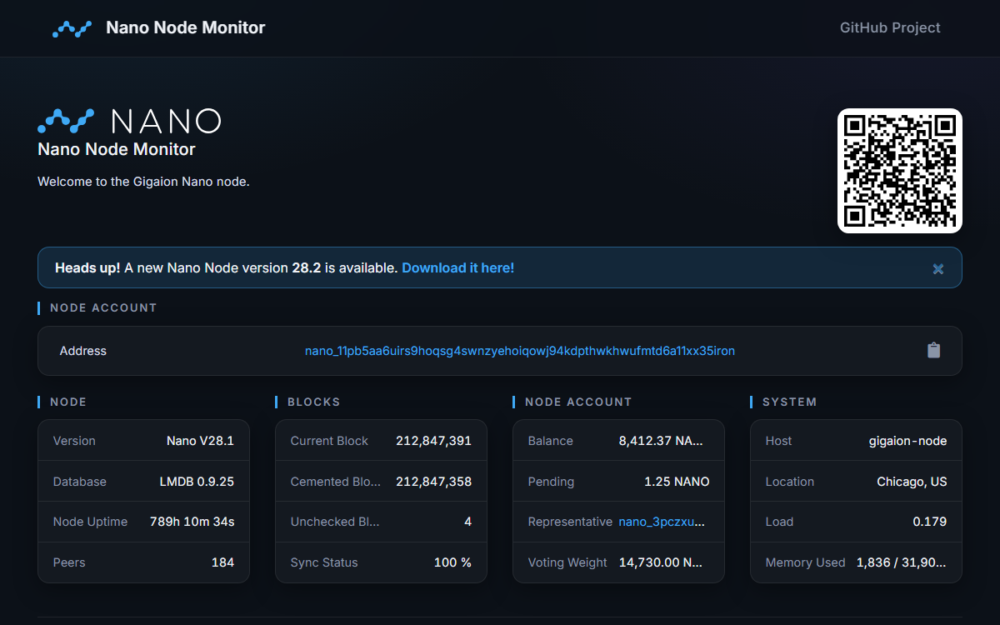

# Nano Node Monitor

 [](https://styleci.io/repos/118352667) [](https://hub.docker.com/r/gigaion/nanonodemonitor/)

Nano Node Monitor is a server-side PHP-based monitor for Nano and Banano nodes. It connects to a running node via RPC and displays it's status on a simple webpage. Being server-side, it does not expose the RPC interface of the Nano node to the public.

This is the GigaionLLC fork of the archived [NanoTools/nanoNodeMonitor](https://github.com/NanoTools/nanoNodeMonitor), modernized for PHP 8.1–8.5 with security hardening of the cache layer and template output.

**AI-enhanced project.** Nano Node Monitor is developed, modernized, and maintained with extensive use of AI coding agents. The PHP 8.5 modernization, the security hardening, and the documentation were all produced and verified with AI assistance. Agent and contributor guidance follows the [AGENT.md](AGENT.md) standard.

|Nano Modern|Nano Light|Nano Dark|Banano Light|Banano Dark|
|-|-|-|-|-|
||||||

## Docker Installation

### Pulling the image

Images are published to the **GitHub Container Registry (preferred)**. The `latest`
tag always tracks the default branch:

    sudo docker pull ghcr.io/gigaionllc/nanonodemonitor:latest

They are also pushed to Docker Hub as a secondary, legacy location:

    sudo docker pull gigaion/nanonodemonitor

### Running

#### Standalone

    sudo docker run -d -p 80:80 -v ~:/opt --restart=unless-stopped ghcr.io/gigaionllc/nanonodemonitor

This will create a directory called _nanoNodeMonitor_ inside your home directory with the _config.php_ inside it.
Edit it according to your needs and you're good to go!

#### Docker Compose

1. Create a directory called _nano_ and go inside it: `mkdir nano && cd nano`

2. Create a new file called _docker-compose.yml_ with the following contents (use the `latest` monitor tag, or pin a release version; replace the node TAG with a proper version):

```
version: '3'
services:
  monitor:
    image: "ghcr.io/gigaionllc/nanonodemonitor:latest"
    restart: "unless-stopped"
    ports:
     - "80:80"
    volumes:
     - "~:/opt"
  node:
    image: "nanocurrency/nano:TAG"
    restart: "unless-stopped"
    ports:
     - "7075:7075"
     - "127.0.0.1:7076:7076"
    volumes:
     - "~:/root"
```
3. Nice! Now execute `sudo docker-compose up -d` to start everything.

4. Inside your home directory you will find a new directory called _nanoNodeMonitor_, edit the _config.php_: `cd ~/nanoNodeMonitor`

5. You will have to change the node IP to the name of the nodes Docker container e.g. `nano_node_1`. Edit the other things as well if you want to.

6. Done!

## Manual Installation

### Prerequisites

- Running Nano Node with RPC enabled ([Tutorial](https://docs.nano.org/running-a-node/node-setup/))
- Webserver with PHP 8.1 – 8.5
- PHP-Curl Module

    `sudo apt-get install php-curl`

### Installation

In your empty webserver directory, e.g. `/var/www/html`, execute:

    git clone https://github.com/GigaionLLC/nanoNodeMonitor .

If you want it to run a subdirectory remove the `.` at the end.

In the `modules` folder, create your own config file by executing:

    cp config.sample.php config.php

## Usage

You will have to add your node's account to the config file `config.php` by modifying the following lines. Make sure to remove the `//` in front of `$nanoNodeAccount`:

```
// account of this node
$nanoNodeAccount = 'nano_1youraccountname24cq9799nerek153w43yjc9atoaeg3e91cc9zfr89ehj';
```

Official documentation for creating an account on the node via RPC can be found at the following URL:

https://docs.nano.org/running-a-node/voting-as-a-representative/#step-2-setup-representative-account

### Upgrading an existing config

Docker containers migrate the config automatically on start. For manual
installations, migrate your `config.php` to the current schema with:

    php scripts/migrate-config.php

The script backs up your old config, carries over all of your settings, maps defunct
block explorers to `blocklattice`, and writes a clean minimal `config.php` with a
`$configVersion` marker so future migrations know where to start. Use `--dry-run`
to preview the result without changing anything.

Configs containing custom PHP logic (e.g. switching on `$_SERVER['HTTP_HOST']`)
are detected and never rewritten — update those manually against `config.sample.php`
and add `$configVersion = 1;` to mark them current.

If you are running a standalone node you might need to modify the IP-address and the port for the RPC in the file `config.php`. It should match the corresponding entries in `~/Nano/config.json`, e.g.

```
// ip address for RPC (default: [::1])
$nanoNodeRPCIP   = '127.0.0.1';

// ip address for RPC (default: 7076)
$nanoNodeRPCPort = '7076';
```

## Creating a Theme

If you're interested in creating your own theme in addition to the official Light,  Dark, and Banano themes, we've made it very simple for you to do so. Check out the [Wiki](https://github.com/GigaionLLC/nanoNodeMonitor/wiki/Create-a-theme) for more info.

## Support

Donations to the forked development of Nano Node Monitor are very welcome to:

    nano_11pb5aa6uirs9hoqsg4swnzyehoiqowj94kdpthwkhwufmtd6a11xx35iron
